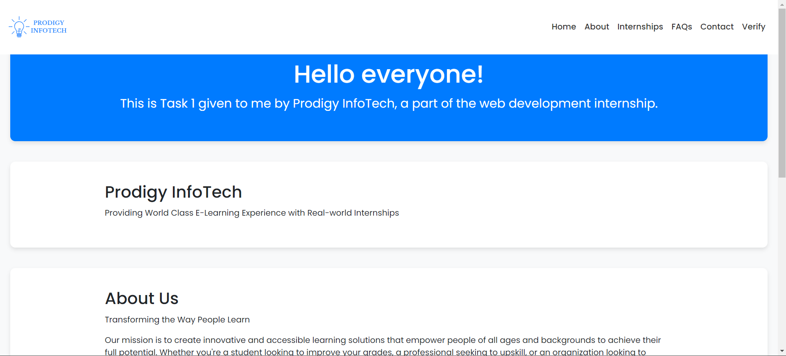
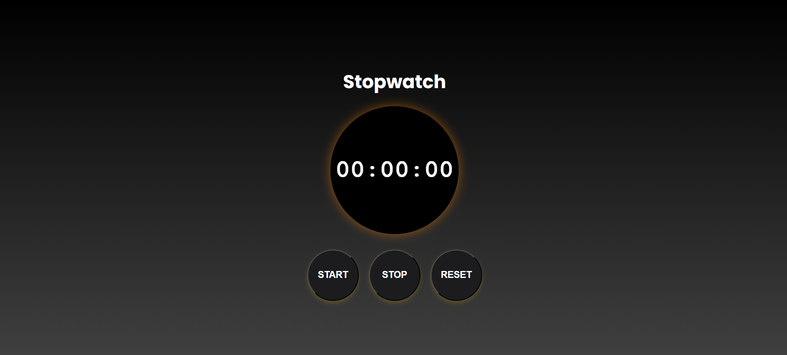
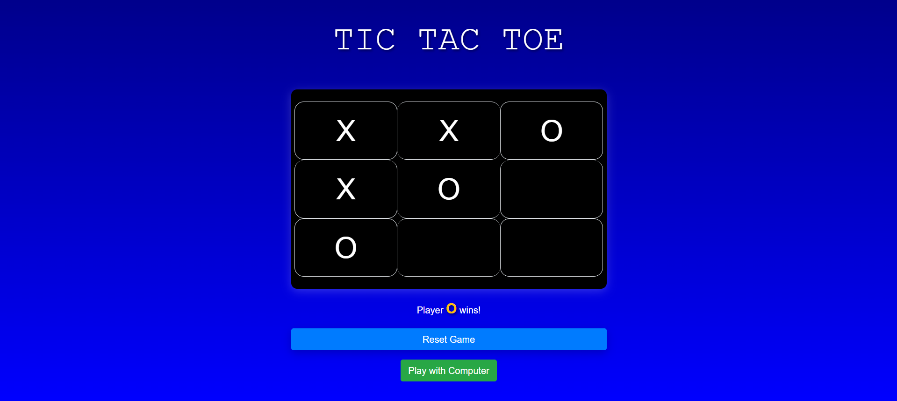
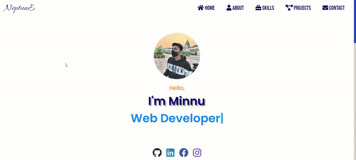
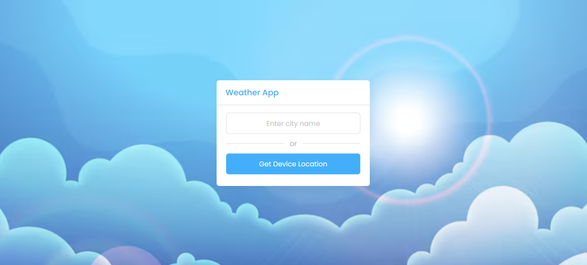
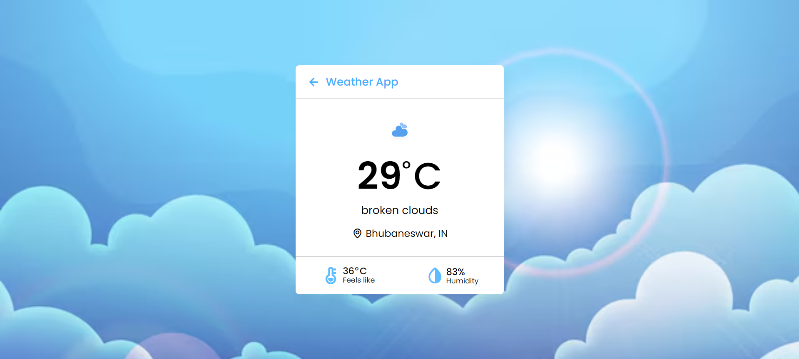

# Prodigy Infotech Web Development Internship Tasks

This repository contains my solutions to the tasks assigned during the web development internship at Prodigy Infotech.

## Tasks

### Task 1

[Responsive Landing Page](https://github.com/minnukota381/Prodigy_WD_01)

### Task 2

[Stopwatch Web Application](https://github.com/minnukota3811/Prodigy_WD_02)

### Task 3

[Tic-Tac-Toe Web application](https://github.com/minnukota381/Prodigy_WD_03)

### Task 4

[Personal Portfolio website](https://github.com/minnukota381/Prodigy_WD_04)

### Task 5

[Weather App](https://github.com/minnukota381/Prodigy_WD_05)

